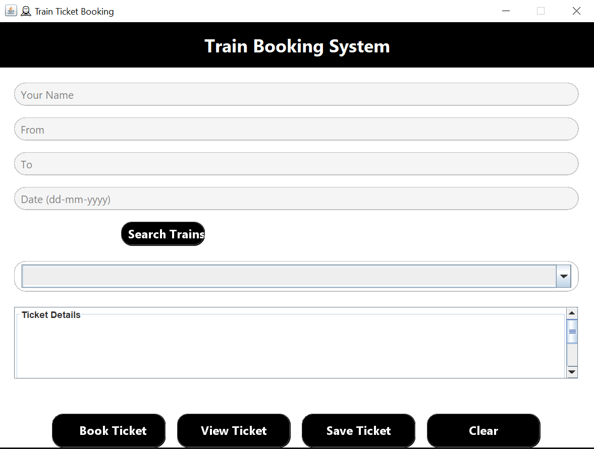
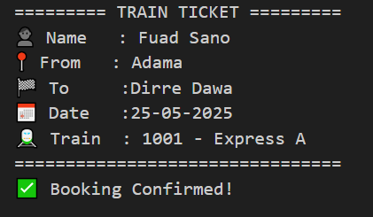

# 🚆 Online Train Ticket Booking System

> A Java-based desktop GUI application that allows users to search, book, view, and save train tickets using a simple and user-friendly interface built with Swing.
---

## 🖥️ Features

- 🔍 Search trains by entering departure and destination
- 📅 Select the date of travel
- 🚉 View available trains from a predefined list
- 🎫 Book a ticket with passenger details
- 💾 Save the ticket information to a `.txt` file
- 👁️ View booked ticket in a popup window
- 🧼 Clear form fields
- 🧑‍🎨 Custom Swing components: rounded text fields, buttons, and combo boxes

---

## 🛠️ Technologies Used

- Java  
- Swing (for GUI)  
- AWT (for GUI components)  

---
## 🖼️ Screenshots

### 🔷 Overall UI Screenshot


### 🔷 Ticket Popup Preview


---

## 🚀 How to Run

1. Ensure Java JDK 8 or higher is installed.
2. Clone the repository:
   ```bash
   git clone https://github.com/mroxygen2024/Train-Ticket-Booking-System.git
   cd TrainTicketBookingSystem

## Compile and run the application:

- javac TrainBooking.java
- java TrainBooking
- Or open the project in an IDE like IntelliJ IDEA or Eclipse and run TrainBooking.java.

## 📁 Project Structure
  TrainTicketBookingSystem/
  ├── TrainBooking.java
  ├── RoundedTextField.java
  ├── RoundedComboBox.java
  ├── RoundedButton.java
  ├── ticket.txt
